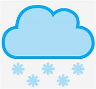
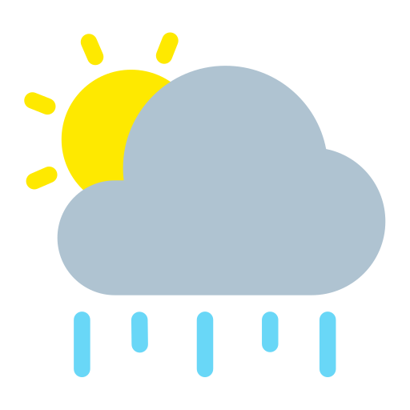

# Weather App
A simple weather app that fetches real-time weather data using the OpenWeatherMap API.

## Features
- Search weather by city name
- Displays:
   - Temperature
   - Humidity
   - Wind speed
- Responsive design

 ## Live Demo
 [Text you want to show](https://parijain05.github.io/Weather-App-API-based-/)

 ## Tech Stack
 - HTML
 - CSS
 - JavaScript
 - OpenWeatherMap API

## How to Use
1. Clone the repository:
git clone https://github.com/PariJain05/Weather-App-API-based-.git
2. Open `index.html` in your browser
3. Enter a city name and get live weather info!

## API Used
-[OpenWeatherMap API](https://openweathermap.org/api)

## Weather Icons & Features

 Icon                                       Description                   
     Search Icon       
  Humidity         
   Wind Speed     
         Rain             
       Clear Sky        
        Cloudy           
          Mist             
         Snow
    Drizzle

 
